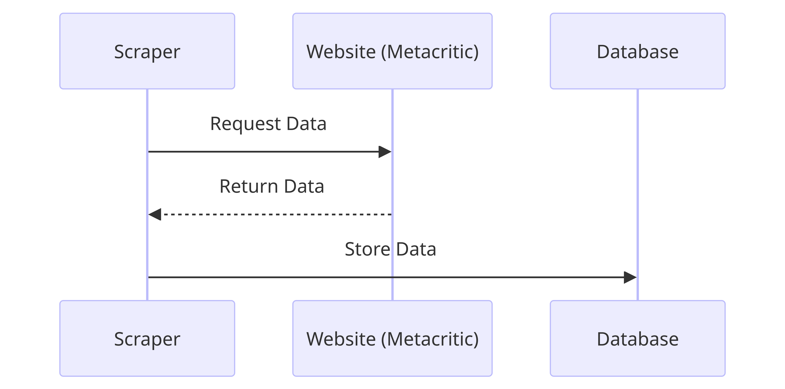

# Metacritic Scraper

## What's the metacritic-scraper project?

Welcome to the metacritic-scraper project! This repository is a part of my portfolio and includes the source code for a
scraper designed to extract information from the Metacritic website. Metacritic is renowned for aggregating reviews of
movies, TV shows, music, and games, and providing a weighted average of ratings. This scraper enables users to collect
review data and critical analysis, which is highly valuable for market analysis, personalized recommendations, and
academic research.

## Technologies Used

- `Python 3.11`: Primary programming language.
- `BeautifulSoup`: Used for HTML parsing.
- `requests_cache`: For making HTTP requests.
- `plotly`: For data visualization.

## Legal Disclaimer

Please note that this scraper is intended for educational and research purposes. Users are responsible for complying
with Metacritic's terms of service.

## Sequence Diagram Explanation

The sequence diagram attached to this documentation provides a visual representation of the interactions between
different components within the system over time. It outlines the process where data is scraped from the Metacritic
website, stored in a database, and then used to generate various graphs.



### Key Components:

- **Scraper**: Initiates the process by requesting data from the website.
- **Website (Metacritic)**: Responds with the requested data.
- **Database**: Stores the scraped data.
- **Plotly Graphs**: Uses the data to generate visualizations:
    - **Distribution Ratings**: Shows the distribution of ratings.
    - **Most Popular per Decade**: Highlights the most popular items per decade.
    - **Perfect Classifications**: Showcases items with perfect classifications.

Each graph type has a dedicated process that generates specific visualizations based on the data received from the
database. This systematic approach ensures that the data is not only collected efficiently but also visualized in a
manner that is insightful and accessible.

## Getting Started

These instructions will get you a copy of the project up and running on your local machine for development and testing
purposes.

### Prerequisites

What things you need to install the software and how to install them:

- Python 3.x
- pip (Python package installer)

### Installation

A step-by-step series of examples that tell you how to get a development environment running:

1. **Clone the Repository**:

    ```bash
    git clone https://github.com/yourusername/metacritic-scraper.git
    cd metacritic-scraper
    ```

2. **Set Up a Virtual Environment**:

    ```bash
    python -m venv venv
    source venv/bin/activate  # On Windows use `venv\Scripts\activate`
    ```

3. **Install Required Packages**:

    ```bash
    pip install -r requirements.txt
    ```

## Running

- To run the scraper, execute the following command:

    ```bash
    python scraper.py
    ```